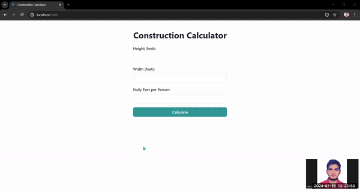

# Getting Started

**First, clone the repository:**

```bash
git clone https://github.com/Hashal890/cognisite-assignment.git
cd cognisite-assignment
```

Install dependencies:

```bash
npm install
# or
yarn install
# or
pnpm install
# or
bun install
```

Run the development server:

```bash
npm run dev
# or
yarn dev
# or
pnpm dev
# or
bun dev
```

# Project Demonstration

**Image Preview:**



**Video Overview:**

[View Video](https://drive.google.com/file/d/1T2cBPYvoI5LSMggoC3IAT5hXLxCdKQu3/view?usp=sharing)

# Technologies used

- [React.js](https://react.dev/learn)
- [JavaScript](https://developer.mozilla.org/en-US/docs/Web/JavaScript)
- [Chakra-UI](https://v2.chakra-ui.com/getting-started)
- [Chart.js](https://www.chartjs.org/docs/latest/)
- [React Chart.js 2](https://www.npmjs.com/package/react-chartjs-2)
- [React Icons](https://react-icons.github.io/react-icons/)
- [CSS](https://developer.mozilla.org/en-US/docs/Web/CSS)
- [HTML](https://developer.mozilla.org/en-US/docs/Web/HTML)
- [Vercel](https://vercel.com/)
